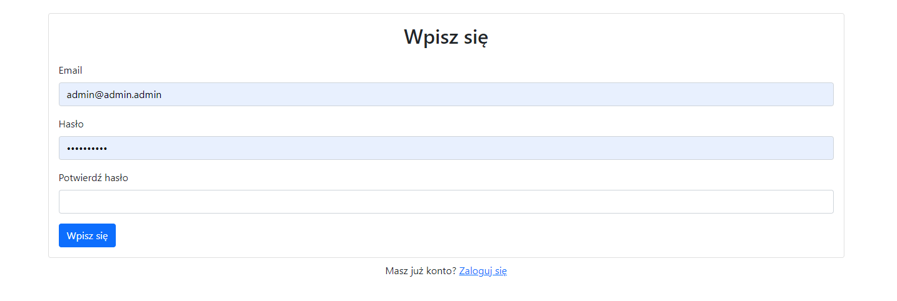
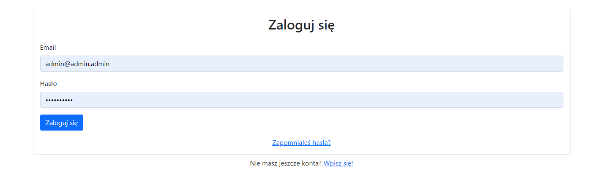
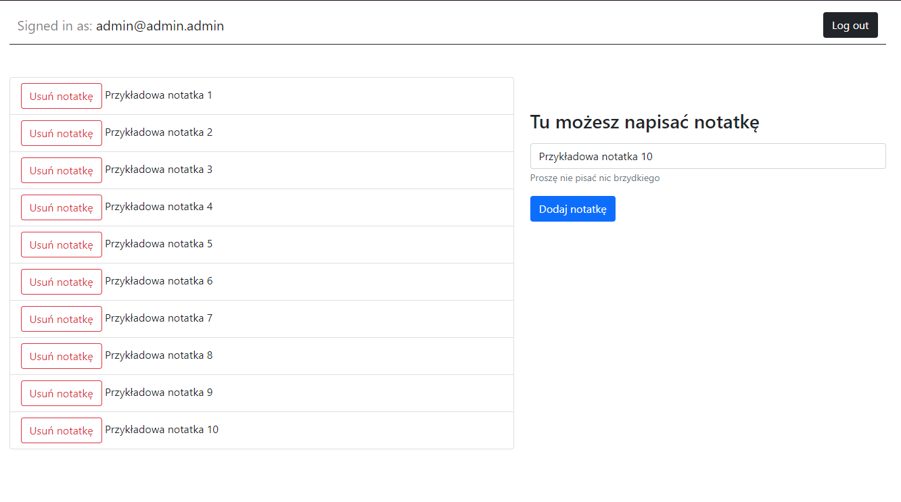
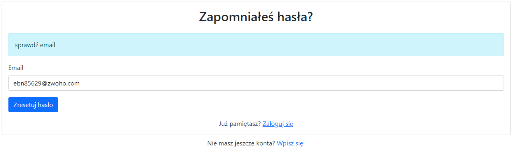

# NoteSaver

Aplikacja umożliwiająca zpaisywanie notatek

## Stack Technologiczny
* Firebase
* React.js
* Bootstrap

## 
Aplikacja jest oparta na technologii React we współpracy z Realtime Database od Firebase. Jest intuitywna i Skierowana do codzienniego użytkowania. Posiada walidację podczas logowania i rejestracji, wypisując błąd jeśli coś poszło nie tak z wykonaniem rekordu w bazie danych.
### Ekran Rejestracji 
Umożliwia użytkownikowi dodanie konta.

### Ekan logowania
Umożliwia zalogowanie się użytkownika.

### Strona główna
Na głównej stronie można dodać notatkę, usunąć ją bądź się wylogować.

### Zapomniałem hasła
Aplikacja umożliwia zresetowanie hasła którego zapomniał użytkownik pod warunkiem że pamięta on mail na który zarejestrowane jest jego konto.

## Authors 
* Piotr Kiedrowski